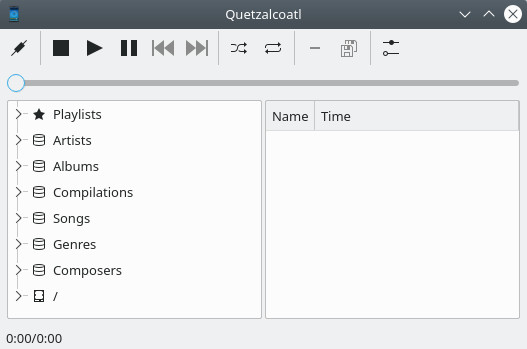
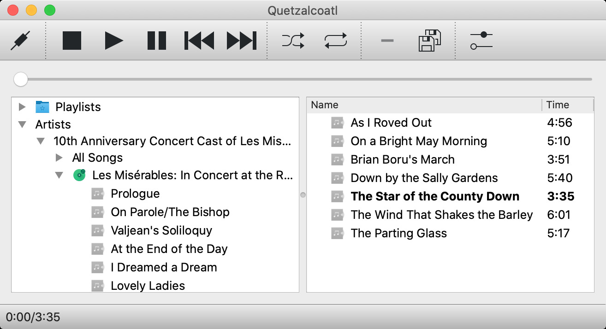

# Quetzalcoatl

Quetzalcoatl MPD is an MPD client. It targets Linux and OS X.

## Screenshots

## Usage

The left pane is your music "database" (what MPD calls its library); the right pane is your "queue" (what MPD calls the playlist).

Double-click on a song to play it or its album, as appropriate.

Drag songs from the database to the queue.

Drag songs around in the queue.

Drag the slider to seek within the current song.

Hover your mouse over any song or toolbar button to get a tooltip.

Select songs in the queue to see their combined time. Very useful if you're picking songs for a mix CD.

Right-click on a stored playlist (in the database pane) for options to rename or delete it.

## Credits

It currently uses:

- Breeze icons
- [Qt Creator's .clang-format](https://github.com/qt-creator/qt-creator/blob/master/.clang-format)

## History

Previous versions are described here:

- [Quetzalcoatl 2.0 Screenshot](http://duganchen.ca/quetzalcoatl-2-0-screenshot/)
- [Quetzalcoatl Music Player Client For MPD](https://duganchen.ca/project/software-development/quetzalcoatl-mpd-client/)

Those versions have been moved to [quetzalcoatl-legacy](https://github.com/duganchen/quetzalcoatl-legacy). The master branch is the first release, and the experimental branch is the second one.

## Developer's Guide

Generally speaking, build it like this if you're developing it:

    mkdir build
    cd build
    cmake .. -DCMAKE_BUILD_TYPE=Debug -DCMAKE_EXPORT_COMPILE_COMMANDS=ON

Doing a debug build will (generally) enable QDebug logging, and this will also give you a compile_commands.json file that you can use to set up clang-based tooling.

Then you can run the application:

    ./quetzalcoatl

Or the unit tests:

    ctest

## Linux Setup

If you're using this in a Linux desktop that isn't Qt-based (pretty much anything other than KDE or LXQt), then please see the following guide to set up Qt apps in general:

- [Getting Qt apps to look good in GTK desktops](https://www.linuxquestions.org/questions/linuxquestions-org-member-success-stories-23/getting-qt-apps-to-look-good-in-gtk-desktops-4175684308/)
